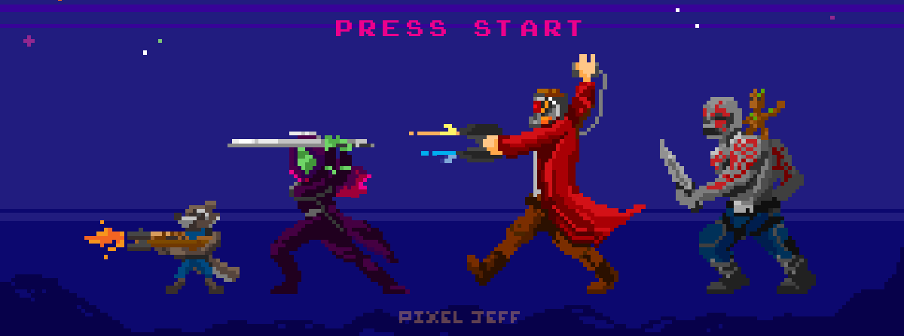
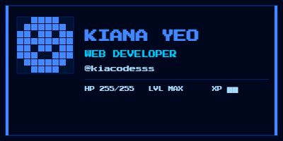

<table>
<tr>
<td width="55%" valign="top">

# Hi, I'm Kiana 👋

### Computer Science Student | Aspiring Software & Web Developer

I'm a Computer Science student interested in software development,
web development, and building practical technology solutions.
 
</td>

<td width="35%" align="center">

</td>
</tr>
</table>

---

## 🌌 About Me

- 🎓 BS Computer Science student
- 💻 Interested in software and web development
- 🧩 Enjoy building projects and solving technical problems
- 🌱 Continuously learning and expanding my development skills

---

## 🚀 Tech Stack

  
### 💻 Languages

### ⚙️ Development & Tools

### 🎨 Design & Productivity

## 📊 GitHub Stats

 

---

## 🚀 Featured Projects

### 🎮 ANIANA — A Trust System Game

A Java-based game developed to explore object-oriented programming,
game logic, and software development concepts.

**Tech:** Java · Maven · Tiled · NetBeans

🔗 [View Repository](https://github.com/kiacodesss/ANIANA-Trust-System-Game)

---

## ✨ Currently Learning

- Data Structures & Algorithms
- Python Development
- Web Application Development
- Software Engineering Practices

---

## 📡 Connect With Me

